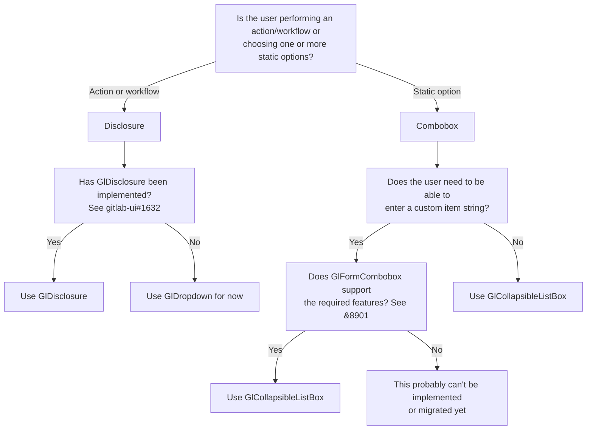

In general terms, a "dropdown" is a combination of a trigger that opens a panel. A dropdown can mean many things while not being specific to any particular implementation. For that reason we've specified two distinct components and included variants where necessary. While the UI is nearly identical for each, there are important considerations related to a user's task and underlying semantics.

Read on to learn the differences, or go directly to the [disclosure widget](/components/dropdown-disclosure) and [combobox](/components/dropdown-combobox) component pages for specifics.

## Disclosure

A [disclosure widget](/components/dropdown-disclosure) is a type of dropdown that includes a button that opens a panel of links or actions. Think _a user needs to do something or go somewhere_ when you consider a disclosure. A disclosure is more forgiving than a combobox semantically, since nearly any element can be a child of the expanded panel. It also includes an optional header to provide more context fort the panel content.

## Combobox

A [combobox](/components/dropdown-combobox) is a type of dropdown that includes a panel of options typically opened by a button or text input. Think _a user needs to select an option_ when you consider a combobox. A combobox is the more complex of the two and includes two different implementations, `GlCollapsibleListbox` and `GlFormCombobox`. In addition to the listbox of options with particular semantics, a combobox includes the following optional features: header, section titles, and a fixed footer with related actions.

## Which component should you use?

## Related

- A menu (`role="menu"`) is a particular type of dropdown that should only be used for app-like JavaScript actions or functions, like replicating a dropdown in an application. Menus aren't currently used in GitLab since many dropdowns that would include JavaScript actions also include links, making the disclosure a more ideal option.
- The [tooltip](/components/tooltip) and [popover](/components/popover) components share similar interactions with a disclosure and combobox, however their primary use is to provide contextual information and by default don't _drop down_ in the same fashion, making this category less intuitive.
- An [accordion](/components/accordion) is a disclosure widget, but since the end goal is showing and hiding content with a different behavior, it is a separate component with a different purpose.
- A [select](/components/select) (`<select>`) has the closest relationship to the disclosure and combobox, however it's use is limited to the context of a form as much as possible.
