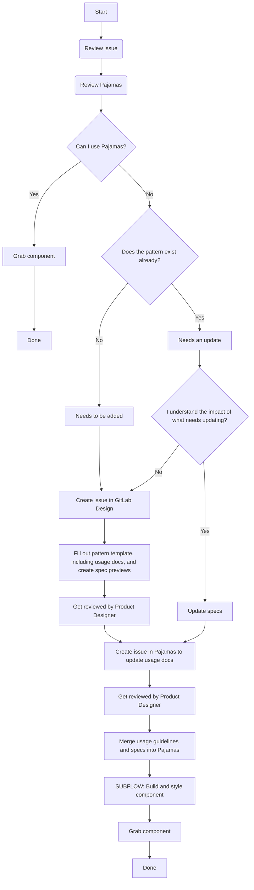

# Component lifecycle

The component lifecycle has the following stages:

* **Create:** A need for a component is identified. Documentation is written 
regarding its usage and the component is created and added to the [GitLab Sketch UI Kit](https://gitlab.com/gitlab-org/gitlab-design/blob/master/doc/sketch-ui-kit.md). 
~"pajamas::create"
* **Build:** The component is added to gitlab-ui, including specs, examples, 
and documentation. The component is added to Pajamas. ~"pajamas::build"
* **Style:** Each component is styled according to the design specs found in 
Pajamas. Components function correctly and match usage guidelines. ~"pajamas::style"
* **Implement:** The documented component is implemented into GitLab the 
product. ~"pajamas::implement"

Some stages may happen in tandem, depending on how mature the component currently
is. For example:

* If the component is already in GitLab and widely used, **build** and
**style** stages may happen together. This often involves migrating styles from GitLab
to Gitlab-UI.
* If the component is not yet available as a Vue component, the **style** stage
may come after the **build** stage.
* If a component is brand new, the **create** stage may need some revisions as the 
**build** and **style** stages progress.

The **implement** stage will come last and could involve removing old HAML components
in order to replace them with the newly defined Vue components.

## Creating a new component

Adding, or not adding, a component to Pajamas should be a deliberate choice. To 
help facilitate this decision, you should be able to answer the following questions:

* Is this a new component or a variation of an existing one?
* Why do existing components not support this use case?
* Will this component be reused beyond the current scope?

Not all components belong in the design system. These are occasional instances 
where a component may live in only one area of the application and is not included 
as part of Pajamas. The design system is here to help build reusable interfaces, 
but not be limiting in terms of how to solve user needs. 

The following diagram outlines the **create** stage and is available to help 
determine when and how a component should be added to Pajamas:

## Building and styling components
=
Next are the **build** and **style** stages. This occurs 
in the [GitLab-UI project](https://gitlab.com/gitlab-org/gitlab-ui) and follows 
the [**build** and **style** diagram](https://gitlab.com/gitlab-org/gitlab-ui/blob/master/doc/component-lifecycle.md).

## Completing a component

Once a component has gone through the **create**, **build**, and **style** stages, 
it can then be marked as *Built* on our [status page](https://design.gitlab.com/components/status).

A completed component should not have the warning alert on the Vue tab.

An MR should be created to add any necessary demos to the Design tab. To prevent 
confusion, we should omit demos until styles are correct.

Once a component is complete, add it to the [Engineering Week in Review](https://docs.google.com/document/d/1Oglq0-rLbPFRNbqCDfHT0-Y3NkVEiHj6UukfYijHyUs/edit).
in order to keep the department informed.
