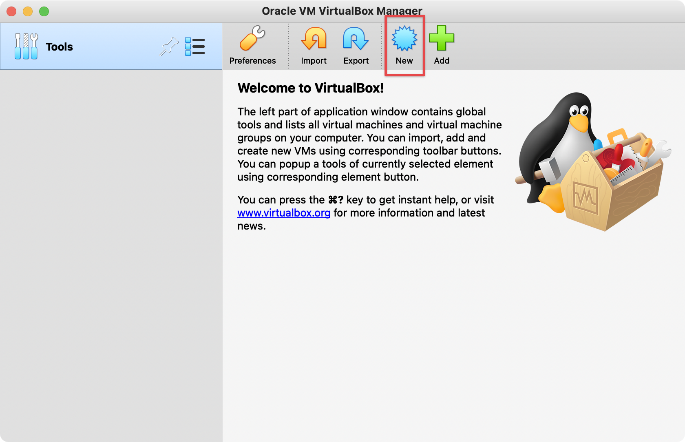
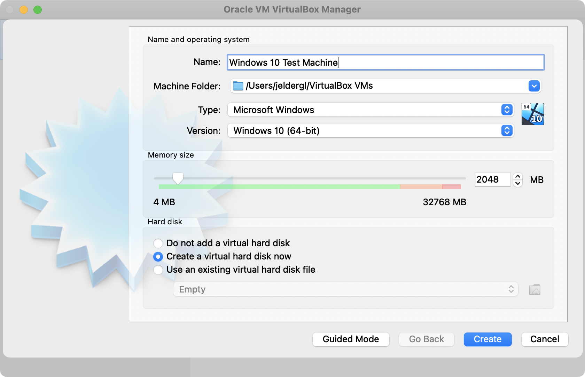
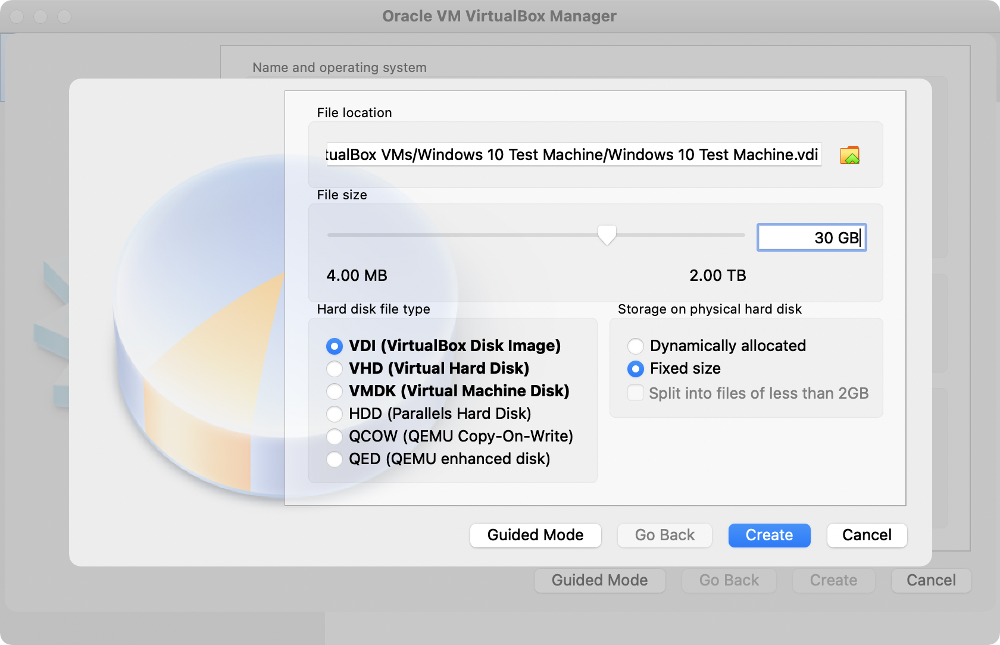
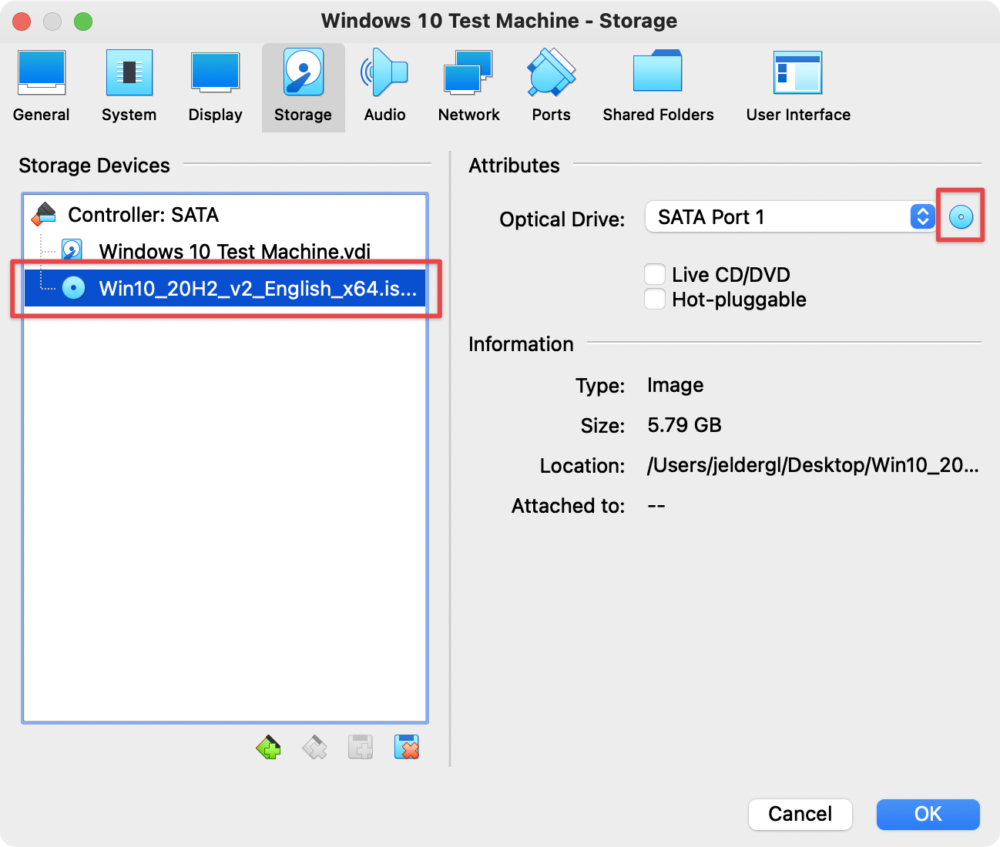
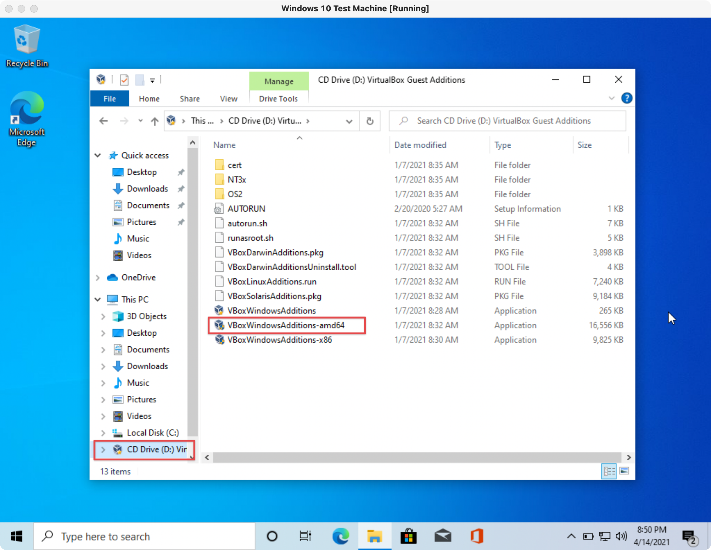
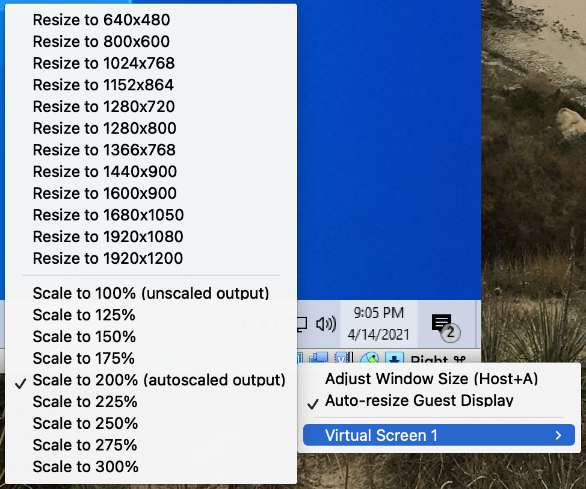
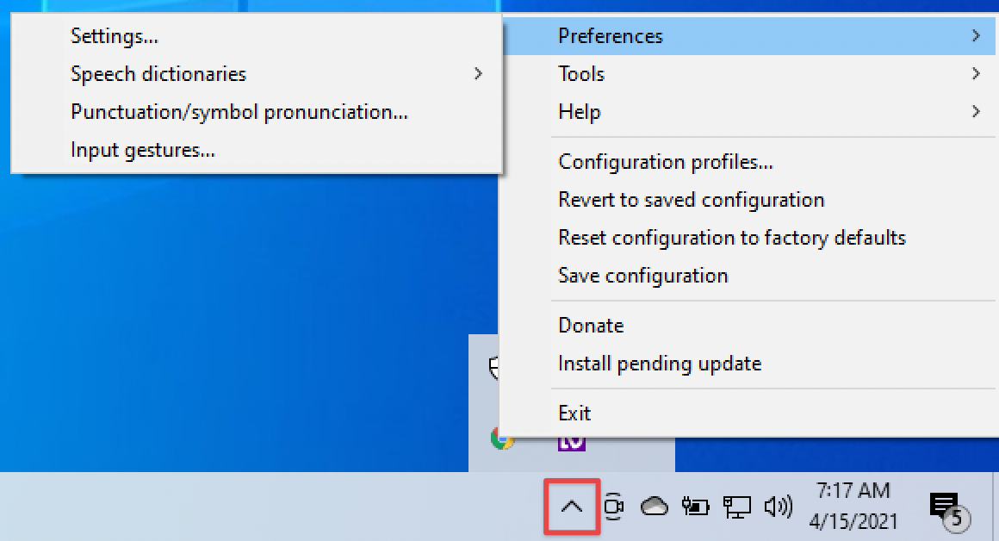
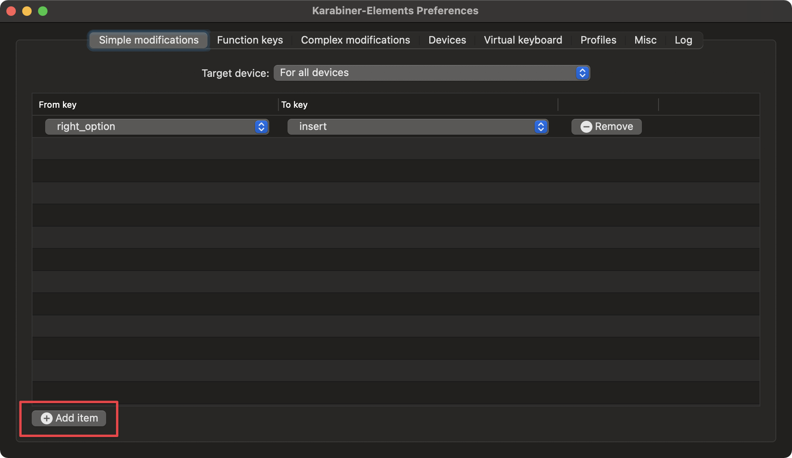

# NVDA + Chrome setup

According to WebAIM’s [Screen Reader User Survey #8 Results](https://webaim.org/projects/screenreadersurvey8/#primary), the NVDA screen reader is the most commonly used. And while JAWS with Chrome is the most popular combination, NVDA with Chrome is not far behind. Given that JAWS may not be the best screen reader to test on, because it attempts to fill in the gaps or guess what label it should use based on context, and with [Chrome increasing in use over Firefox](https://webaim.org/projects/screenreadersurvey8/#browsers), the NVDA with Chrome combination is a safe bet moving forward.

The following instructions walk you through setup of an instance of Windows 10 with NVDA and Chrome through VirtualBox on macOS along with other utilities and tips along the way.

## Contents

- [Install and configure VirtualBox](#install-and-configure-virtualbox)
   - [Guest Additions](#guest-additions)
   - [Shared clipboard](#shared-clipboard)
   - [Screen resize](#screen-resize)
- [Install Chrome](#install-chrome)
   - [Extensions and bookmarklets](#extensions-and-bookmarklets)
- [Install NVDA](#install-nvda)
- [Install Karabiner-Elements](#install-karabiner-elements)

---

## Install and configure VirtualBox

1. Start by downloading and installing [VirtualBox](https://www.virtualbox.org/wiki/Downloads).
1. You'll need to download a Windows 10 Disc Image (ISO File). To do that, go to the [Windows 10 ISO page](https://www.microsoft.com/en-us/software-download/windows10ISO). Under the **Select edition** dropdown choose "Windows 10" and then select the **Confirm** button to continue.
1. Choose "English" as the product language and select **Confirm** to continue.
1. Select the **64-bit Download** button. The ISO file will be several GB and will take a few minutes to complete.
1. Open VirtualBox and select the **New** button that looks like a badge. A window will appear that begins the process of creating your Windows 10 instance.
   
1. Using the "Expert mode", name your device and leave the other settings as default. Select the "Create a virtual hard disk now" option and then select **Create** to continue.
   
1. You can start off with less space than default, here **30 GB** has been entered. Choose the "Fixed size" option. Using a predetermined size should help with performance since it won’t have to dynamically be allocated. Select **Create** to continue.
   
1.Select the **Settings** button and a new window will open. Go to the **Storage** tab. 
1. In the left pane, choose the item with the CD icon. Then on the right, choose the CD icon and locate the ISO file you downloaded earlier. Select **OK** to continue.
   
1. Back in the main VirtualBox window, double-click the name of your virtual machine to start it. A window will open where the ISO file should be selected to start from. Select the **Start** button.
1. The virtual machine should start and begin the Windows install. When you get to the **Activate Windows** screen, select the "I don't have a product key" option.
1. In the next panel, select the "Windows 10 Home" option and select **Next** to continue.
1. Accept the license and continue.
1. Choose the custom install option. In the resulting view the drive that was created should be highlighted. Select **Next** to continue. Windows will begin installing.
1. If you don't have an account, you'll need to create one to continue and complete the Windows setup. Once Windows is running, continue to the next section.

### Guest Additions

1. In the top menu for VirtualBox, select **Devices > Insert Guest Additions CD Image**. Guest Additions includes device drivers and system applications that optimize the guest OS for better performance and usability.
1. Now, back in Windows, navigate to the **CD Drive (D)** and double-click the **VBoxWindowsAdditions-amd64** file. Use the default install settings and choose to reboot.
   

### Shared clipboard

Being able to copy and paste from the host to guest can be very helpful.

1. In the top menu for VirtualBox, select **Devices > Shared Clipboard > Host to Guest** (or another setting if you prefer).

### Screen resize

There are several screen resize options, and you can choose what suites your preference.

1. Locate the monitor icon in the bottom right of the virtual machine window. Under the **Virtual Screen 1** item you'll find many options to choose from, and you'll likely need to test out a few options depending on your monitor resolution.
   

## Install Chrome

1. Using the default browser, Edge, navigate to https://www.google.com/chrome/ and download the Chrome browser.
1. Run the **ChromeSetup.exe** file.
1. You will be able to set up Chrome as your preferred browser, as well as sign in to the account you prefer to use.

### Extensions and bookmarklets

The following utilities are not required, but can help when testing certain aspects of a webpage.

1. [Web Developer](https://chrome.google.com/webstore/detail/web-developer/bfbameneiokkgbdmiekhjnmfkcnldhhm): Many tools to help inspect and modify page settings.
1. [JavaScript Bookmarklets for Accessibility Testing](https://pauljadam.com/bookmarklets/): Highlight different parts of the page for review.
1. [1.4.12 Text Spacing](https://dylanb.github.io/bookmarklets.html): A bookmarklet to test that text spacing can be adjusted.
1. [axe DevTools - Web Accessibility Testing](https://chrome.google.com/webstore/detail/axe-devtools-web-accessib/lhdoppojpmngadmnindnejefpokejbdd): Accessibility checker.
1. [WAVE Evaluation Tool](https://chrome.google.com/webstore/detail/wave-evaluation-tool/jbbplnpkjmmeebjpijfedlgcdilocofh): Evaluate web accessibility.
1. [ChromeLens](https://chrome.google.com/webstore/detail/chromelens/idikgljglpfilbhaboonnpnnincjhjkd): Visual impairment simulation and a tab-tracker that allows you to record the focus order.

## Install NVDA

NVDA (NonVisual Desktop Access) is a fully functional screen reader that is free, and open-source. You can also choose to add a donation at the time of download.

1. Navigate to https://www.nvaccess.org/download/ and download NVDA.
1. Run the **nvda_2020.4.exe** file (your version may be a little different depending on what is available).
1. Unless you want NVDA running all the time, uncheck the "Use NVDA during sign-in" checkbox and continue with the install.
1. In the **Welcome to NVDA** window you can leave the default options as-is. Select **OK** to continue.

You’ll notice that NVDA begins speaking immediately, and announces everything that your mouse hovers. This is how some sighted screen reader users may use the tool. For our testing purposes you’ll want to turn that off. We'll also adjust some other settings.

1. At the bottom Windows toolbar, locate the chevron pointing up and select it, then select the NVDA icon and go to **Preferences > Settings**.
   
1. Under **General**, uncheck the "Use NVDA during sign-in" option.
1. Under **Speech**, choose your preferred voice and speech rate. "Microsoft Zira" and "Microsoft Mark" are higher pitched, which can be helpful to hear above other noise.
1. Under **Mouse**, uncheck the "Enable mouse tracking" option.
1. Select **Apply** to save your settings. You can close the window.
1. It can be helpful to visualize the speech output of the screen reader. to do that, again locate the chevron pointing up in the toolbar and select it. Next, select the NVDA icon and go to **Tools > Speech viewer**.
1. You should now see the **NVDA Speech Viewer** window. It can be resized and positioned as needed. The text within can be copied, which is helpful when reporting what the screen reader announced.
1. Lastly, at the bottom of the **NVDA Speech Viewer** window, check the "Show Speech Viewer on Startup" checkbox.

For help using NVDA, read or download Deque University's [NVDA Keyboard Shortcuts](https://dequeuniversity.com/screenreaders/nvda-keyboard-shortcuts) resource.

## Install Karabiner-Elements

Karabiner-Elements is a macOS app that allows you to remap keys. NVDA relies on the <key>insert</key> by default to run commands, which Mac keyboard don’t have. By using the utility you can remap an unused key to function in the same way. If you happen to have a PC keyboard you can skip this section.

1. Start by downloading and installing [Karabiner-Elements](https://karabiner-elements.pqrs.org/).
1. In order to complete the install open **System Preferences** and go to **Security & Privacy > General** where you can enter the admin password to install.
1. Go to the **Security & Privacy > Privacy** section, and under **Input Monitoring** on the left. Ensure that "karabiner_grabber+ and "karabiner_observer" are checked in the right panel. You can now close **System Preferences**.
1. Open the Karabiner-Elements app and select **Add item**.
   
1. For the **From key** choose <key>right_option</key> (or another key you don't frequently use).
1. For the **To key** choose <key>insert</key>.
1. Karabiner-Elements should be running when you are using NVDA in your Windows instance.

Congratulations! If you've made it to the end you should have a great setup to begin your accessibility evaluations. Now, take some time to become familiar with the tools and adjust more settings to your liking.
