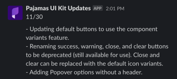

# Pajamas UI Kit contribution and updating guidelines

<!-- Table of contents generated with DocToc: https://github.com/thlorenz/doctoc -->
<!-- START doctoc generated TOC please keep comment here to allow auto update -->
<!-- DON'T EDIT THIS SECTION, INSTEAD RE-RUN doctoc TO UPDATE -->

- [Contributions to Pajamas UI Kit](#contributions-to-pajamas-ui-kit)
- [Structure](#structure)
  - [Files](#files)
  - [Components](#components)
  - [Examples](#examples)
    - [Icons](#icons)
    - [Alert](#alert)
    - [Pagination](#pagination)
    - [Badge](#badge)
    - [Button](#button)
- [Building components](#building-components)
  - [Base components](#base-components)
  - [Elements](#elements)
  - [Variants](#variants)
  - [Using Constraints](#using-constraints)
  - [Using Auto Layout](#using-auto-layout)
- [Adding descriptions, notes, and annotations](#adding-descriptions-notes-and-annotations)
- [Publishing changes](#publishing-changes)
- [Changelog](#changelog)
- [Sharing or linking to changes](#sharing-or-linking-to-changes)
- [Updating the libraries locally](#updating-the-libraries-locally)
- [Plugins](#plugins)
- [Code of conduct](#code-of-conduct)

<!-- END doctoc generated TOC please keep comment here to allow auto update -->

## Contributions to Pajamas UI Kit

Everyone can contribute to GitLab, including our UI design library in Figma, [Pajamas UI Kit][ui-kit-figma]. To contribute to our Pajamas UI Kit, follow these steps:

1. [Create an issue][new-issue] (or assign yourself an existing one) for the work you’re doing. To create a new component or update an existing one, use the [Figma component issue template](https://gitlab.com/gitlab-org/gitlab-services/design.gitlab.com/-/issues/new?issuable_template=Figma%20update).
1. Choose one of the following based on your contribution:
   - If you’re making updates or breaking changes to an existing component in the [Pajamas UI Kit][ui-kit-figma], start with a [branch][figma-branch] of the UI kit. Prefix the branch name with the issue, MR, or epic number, and add your GitLab username as the suffix. For example, **#860-table-component-updates-lvanc**.
   - To create a new component, duplicate our [component template][component-template] to your drafts.
   - For all other changes, create a new file in your drafts.
1. Review the [Structure](#structure) section to learn about how we structure and document our work within Figma.
1. Share a link to your branch or draft in the issue.
1. High-five yourself and go brew some coffee while you wait for the review. Thanks!

We accept contributions from wider community members who share a Figma [draft][figma-docs-drafts] with proposed changes. We also encourage design contributions/improvements to GitLab itself — use its [issue tracker][gitlab-issue-tracker] to add your ideas to an existing or new issue.

## Structure

### Files

The Pajamas UI Kit is comprised of several different files. These files organize separate, but related concepts. Each publishes an asset library that can be enabled in other design files.

The current files are:

- [**Component library**](https://www.figma.com/file/qEddyqCrI7kPSBjGmwkZzQ/Component-library): This is the main file for design components that are used in Pajamas and in all other files. The asset library is published as the "Component library" and enabled for all team files. This file has both typescale and data visualization enabled for use within, but those libraries are not published as part.
- [**Typescale - Documentation Markdown**](https://www.figma.com/file/V3HKN83B7rf2T6sseLMrxa/Typescale-Documentation-Markdown): Documentation markdown is defined as any markdown that is written outside of issuable pages, such as a README or Wiki page. Content written using markdown includes typography that contains fixed margins and increased line-heights to improve readability. Published as the "Typescale - Documentation Markdown" library.
- [**Typescale - Compact Markdown**](https://www.figma.com/file/mjAZxHkK95TlQ6L14aNp2M/Typescale-Compact-Markdown): Within certain views, the markdown type scale is decreased in order to more closely align copy with other UI components. Compact markdown is used for descriptions and comments on issue and merge request pages. Content written using markdown includes typography that contains fixed margins and increased line-heights to improve readability. Published as the "Typescale - Compact Markdown" library.
- [**Data Visualization**](https://www.figma.com/file/17NxNEMa7i28Is8sMetO2H/Data-Visualization): Components, styles, and charts used within GitLab. Published as the "Data Visualization" library.
- [**Product pages**](https://www.figma.com/file/tzpLCamRZNr2tTPwCP2UY4/Product-Pages): Components, layouts, regions, and page templates used within GitLab. Items herein are not globally used throughout the product and not included in the main component library. Published as the "Product Pages" library.
- [**Figma for GitLab**](https://www.figma.com/file/73OcYdBfOaK2xlChC3tbNX/Figma-for-GitLab): An intro deck into how GitLab uses Figma.

### Components

With Figma, components are organized in the asset library by how they are structured and named in the file. The default hierarchy is **File/Page/Frame/Layer**. There are two methods for organizing components:

1. Using Figma's [Variants](https://help.figma.com/hc/en-us/articles/360056440594-Create-and-use-variants) feature.
2. Using a slash naming convention.

For the rest of this article, components created with Figma’s variants feature will be referred to as **variant** or **variants**. Here’s our working hierarchy for structure and naming, the file name has been left out for brevity:

- **Page:** [Component]
- **Frame:** [Component], [Category], [Group], [Elements] or literally “Variants.” “Variants” is the default frame name when components aren’t created with the variants feature.
- **Layer:** [Property=Value, Property=Value] as a variant or [Breakpoint/Item/Size/State] when manually organized.
  - Components are created for the largest viewports by default. When a smaller viewport causes the component layout to change add a property.
  - Optional breakpoints: XS, SM, MD, LG, XL, breakpoints can also use symbols to indicate range, such as ≥MD or ≤SM
  - Optional sizes: XS, SM, MD, LG, XL, XXL

When creating a component as a variant, only a single instance of that component will be listed in the asset library. After adding the component to your design you’ll have the ability to choose the variant needed based on available properties (see [examples](#examples) below).

If a component is not part of a variant container, numerically prefixing the breakpoint and size abbreviations correctly orders them in the asset library in a way that helps a user understand hierarchy (see [examples](#examples) below).

Lastly, when you create a component variant in Figma it automatically adds a border radius and dashed purple border to the frame. Remove both the border radius and border.

### Examples

#### Icons

- **Page:** Icons
- **Frame:** Actions
- **Layer:** Export
- **Result:** Icons/Actions/Export

#### Alert

- **Page:** Alert
- **Frame (container):** Alert
- **Layer:** Variant=Danger, Max-width=False
- **Result:** Alert/Alert

#### Pagination

- **Page:** Pagination
- **Frame:** Pagination
- **Layer:** Variant=Default, Breakpoint=≥MD, Truncation=None
- **Result:** Pagination/Pagination

#### Badge

- **Page:** Badge
- **Frame:** Pipeline badge
- **Layer:** Variant=Running, Size=SM
- **Result:** Badge/Pipeline badge

#### Button

- **Page:** Button
- **Frame:** Default
- **Layer:** Category=Primary, Type=Dropdown split, Size=MD
- **Result:** Button/Default

| **Layers panel** | **Assets panel** |
| ------ | ------ |
|  |  |

## Building components

### Base components

Some components are built from **base** components. Base components provide foundational configuration, structure, or other settings for components to be built from. They are not published to the library, because we only want the variants created from them to be available for direct use. A base component name is prefixed with "_Base" and the underscore prevents it from being published. A base component can also use variants. A change to a base component should propagate to any components built from it. In other systems you may see them called primitives, or master components. We chose “base” to indicate a starting place.

### Elements

With a nod to [atomic design](https://bradfrost.com/blog/post/atomic-web-design/), an **element** is something that cannot be broken down any further, and is primarily used in the construction of other components. In other words, it’s rarely used alone. Since elements can be used and swapped in other components, they’re published to the library. A good example of an element is a checkbox, which could be used in forms with a label, or as part of a multiselect dropdown.

### Variants

A **variant** is the most common form of a component. It is available to use as-is from the asset library, and does not require style overrides, although they may be available. In most cases, the content can be overridden for the context. Variants are often built from a [base component](#base-components), but this isn’t required. A variant often has properties associated with it that can be quickly swapped in the properties panel.

### Using Constraints

Objects within a component will [use constraints][figma-docs-constraints] when they need to maintain their position relative to the component bounds, or content within. Complex, responsive components can be created by combining frames and [layout grids][figma-article-layout-grid]. A tooltip is a good candidate for constraints, so that directional tips can always be placed correctly in relation to the component bounds as the content grows.

### Using Auto Layout

Components with [Auto Layout][figma-docs-auto-layout] dynamically resize based on the content within. This works well for components that need to maintain padding and spacing. A button is a good candidate for auto layout, because it can resize horizontally based on label length, and whether or not icons are included. Complex responsive-like components, like a modal, can be created with auto layout.

## Adding descriptions, notes, and annotations

We use three primary methods to add descriptive, helper content for components and design assets in Figma.

1. **Layer**
   - Audience: designers and users of the design file.
   - Use text layers for headings to categorize variants and instances.
   - Use the **Utility/Sticky** component to add a visible note in relation to the design. There are plugins that do similar, but we don’t want to rely on them staying up-to-date. Notes like these should be temporary in nature, and not need to persist.
1. **Comment**
   - Audience: everyone.
   - Use comments to engage with others in a conversation about the design. These conversations can be resolved and will persist as part of the history of the design file.
   - Use comments for annotations on instances, where descriptions are not possible.
   - Use comments when the intended audience may not have edit permissions, since component descriptions are limited to editors at the point of use. This would be beneficial for developer handoff.
1. **Component description**
   - Audience: designers who are referencing or using final components in new designs.
   - Use descriptions to identify the purpose and intended use of the component.
   - Consider using keywords in the description as meta for search. For example, “Keywords: wrench, tool, admin” used for a wrench icon that is used to represent admin in the product.
   - Consider mentioning where the component is used in the product, or for what purpose.
   - Include usage notes that are applicable at the point of use.
   - Keep descriptions short, when possible.
   - Add a documentation link (to Pajamas) when possible.

| **Component description and link in library** | **Description and link when inspecting** |
| ------ | ------ |
|  |  |

## Publishing changes

Figma library updates are published by a [Figma maintainer][figma-maintainers], regardless of how minor. To support our [transparency value][handbook-transparency], follow these best practices:

- Changes should be reviewed by another designer in a branch or draft before a Maintainer adds it to the Pajamas UI Kit file.
- Before closing the Pajamas UI Kit file, changes should be published so other designers are aware of what’s been changed, and by whom. It is possible to only publish selected changes.
- Use dashes to list changes (no formatting options for the publish message field).

## Changelog

Changes to the Pajamas UI Kit files are documented in the [file history](https://help.figma.com/hc/en-us/articles/360038006754-View-a-file-s-version-history) and we're currently leveraging this as the changelog.

Figma will automatically update the history with:

- Autosaved versions
- Merged branches
- Created branches
- Branch updates from main

It's also possible to manually [add a new version](https://help.figma.com/hc/en-us/articles/360038006754-View-a-file-s-version-history#Create_a_new_version) that includes a title and description. This can be done to intentionally create a version to track specific changes to a component or styles.

## Sharing or linking to changes

Because components can be in multiple frames on a page, it’s best to link to the entire page when referencing as a design spec in the [Pajamas documentation][pajamas]. Otherwise, you can link directly to the specific frame in issues, merge requests, and other places where a specific portion of the design is referenced.

## Updating the libraries locally

If you have any of the available libraries enabled in a file you’ll occasionally see a toast message in Figma notifying you that there are updates to those library assets. You can choose to update items individually or in a batch.

Not all updates will be desireable or immediately needed however, and some may even introduce breaking changes. For that reason it’s recommended to review the published notes in the [#design-system](https://gitlab.slack.com/archives/CDNNDD1T3) Slack channel (internal). If you’re still uncomfortable with how your work might be impacted, first make a duplicate of your file and test the updates there.

## Plugins

We don’t use plugins for critical actions or capabilities, to avoid making any part of the design process reliant on plugin updates or functionality. Rather, we believe that each user should determine which plugins to use for their own workflow.

## Code of conduct

As contributors and maintainers of this project, we pledge to respect all
people who contribute through reporting issues, posting feature requests,
updating documentation, submitting pull requests or patches, and other
activities.

We are committed to making participation in this project a harassment-free
experience for everyone, regardless of level of experience, gender, gender
identity and expression, sexual orientation, disability, personal appearance,
body size, race, ethnicity, age, or religion.

Examples of unacceptable behavior by participants include the use of sexual
language or imagery, derogatory comments or personal attacks, trolling, public
or private harassment, insults, or other unprofessional conduct.

Project maintainers have the right and responsibility to remove, edit, or
reject comments, commits, code, wiki edits, issues, and other contributions
that are not aligned to this Code of Conduct. Project maintainers who do not
follow the Code of Conduct may be removed from the project team.

This code of conduct applies both within project spaces and in public spaces
when an individual is representing the project or its community.

Instances of abusive, harassing, or otherwise unacceptable behavior can be
reported by emailing `contact@gitlab.com`.

This Code of Conduct is adapted from the [Contributor Covenant](http://contributor-covenant.org),
version 1.1.0, available at [http://contributor-covenant.org/version/1/1/0/](http://contributor-covenant.org/version/1/1/0/).

[component-template]: https://www.figma.com/file/OmvFfWkqEsdGhXAND133ou/Component-template?node-id=0%3A1
[figma-article-layout-grid]: https://www.figma.com/blog/everything-you-need-to-know-about-layout-grids-in-figma/
[figma-docs-auto-layout]: https://help.figma.com/article/453-auto-layout
[figma-docs-constraints]: https://help.figma.com/article/54-constraints
[figma-docs-drafts]: https://help.figma.com/hc/en-us/articles/360041543473#drafts
[handbook-transparency]: https://about.gitlab.com/handbook/values/#transparency
[gitlab-issue-tracker]: https://gitlab.com/gitlab-org/gitlab/issues
[new-issue]: https://gitlab.com/gitlab-org/gitlab-services/design.gitlab.com/issues/new
[pajamas]: https://design.gitlab.com/
[figma-maintainers]: https://about.gitlab.com/handbook/engineering/projects/#design.gitlab.com_maintainers_Figma
[ui-kit-figma]: https://www.figma.com/community/file/781156790581391771
[figma-branch]: https://www.figma.com/best-practices/branching-in-figma/
